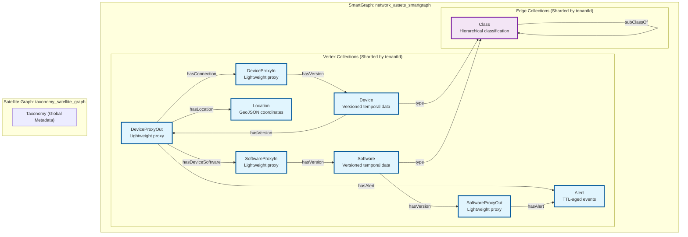

# Scalable Multi-Tenant Temporal Graph Reference Implementation

A production-ready reference implementation for **multi-tenant temporal graph databases** using Arango. Demonstrates tenant isolation via SmartGraphs, time-travel queries, TTL-based data lifecycle management, and horizontal scale-out -- all patterns reusable across network asset management, IAM, cybersecurity, and cloud infrastructure domains.


## Quick Start

```bash
# 1. Clone and install
git clone <repo-url>
cd network-asset-management-demo
python3 -m venv .venv && source .venv/bin/activate
pip install -r requirements.txt

# 2. Configure credentials
cp .env.example .env
# Edit .env with your Arango Oasis credentials

# 3. Run the demo
make demo
```

That's it. The interactive walkthrough guides you through everything with pauses for observation. Press Enter to advance.

> **Requires**: Python 3.9+, an [Arango Oasis](https://cloud.arangodb.com/) cluster (Enterprise Edition required for SmartGraphs), and a modern browser for the Arango Web UI.

See [DEMO_QUICK_START.md](DEMO_QUICK_START.md) for a one-page presenter cheat sheet, or [docs/PRESENTER_GUIDE.md](docs/PRESENTER_GUIDE.md) for a detailed handoff guide.

### Interactive Frontend

The repo includes a React + TypeScript + Tailwind frontend for exploring point-in-time graph snapshots. The frontend calls a local FastAPI service; from the browser, log in with an Arango endpoint, username, and password, choose an accessible database, then choose a tenant from that database.

```bash
# Terminal 1: start the API
make api

# Terminal 2: start the frontend
cd frontend
npm install
npm run dev
```

Open the Vite URL printed by `npm run dev`, connect to your Arango server, choose a database, choose a tenant, and move the slider to query graph state at a specific Unix timestamp. Credentials are held only in the local FastAPI backend's in-memory session store; the browser keeps an opaque session token. Device/software nodes carry the active version at the selected time, while alert nodes appear or disappear based on their temporal validity.

### Available Make Targets

| Command | Description |
|---------|-------------|
| `make api` | Run temporal graph API |
| `make demo` | Run interactive demo (recommended) |
| `make demo-auto` | Run auto-advancing demo |
| `make deploy` | Deploy database (production TTL) |
| `make deploy-demo` | Deploy database with demo TTL (5-minute expiry) |
| `make visualizer` | Install/update visualizer assets (theme, queries, actions) |
| `make test` | Run unit tests (no database required) |
| `make validate` | Run database validation suite |
| `make reset` | Reset database to clean state |
| `make setup` | Install dependencies |
| `make setup-dev` | Install dev dependencies (ruff, pre-commit) |
| `make lint` | Run linter |
| `make clean` | Remove caches and generated files |
| `make help` | Show all targets |

## What the Demo Shows

The demo generates **8 tenants** with **~21,000+ documents** and walks through:

| Step | What Happens | Duration |
|------|-------------|----------|
| 0. Reset | Clean database for fresh start | ~1 min |
| 1. Data Generation | Generate 8 tenants with network assets and taxonomy | ~2 min |
| 2. Deployment | Deploy SmartGraph collections, indexes, and graphs | ~2 min |
| 3. Validation | Verify tenant isolation and data integrity | ~1 min |
| 4. TTL Transactions | Execute real configuration changes with TTL aging | ~2 min |
| 5. Time Travel | Query historical state at specific timestamps | ~2 min |
| 6. Alerts | Demonstrate alert lifecycle and cross-entity correlation | ~1 min |
| 7. Taxonomy | Explore hierarchical classification with satellite graphs | ~1 min |
| 8. Scale-Out | Add tenants and guide cluster scaling | ~3 min |
| 9. Final Validation | Comprehensive system verification | ~1 min |

**Total**: 15-20 minutes for a full interactive walkthrough.

## Architecture



> Unified SmartGraph for tenant-isolated data with Satellite Graph for shared taxonomy metadata. Cross-graph `type` edges connect tenant entities to the global classification system.

### Key Design Patterns

**Proxy Pattern** -- `DeviceProxyIn`/`DeviceProxyOut` and `SoftwareProxyIn`/`SoftwareProxyOut` act as lightweight, stable connection points. Core collections (`Device`, `Software`) hold full temporal data, keeping edge collections lean.

**Unified Temporal Versioning** -- A single `hasVersion` edge collection handles all time-travel relationships. Every versioned document carries `created`, `expired`, and (for historical records) `ttlExpireAt` timestamps. MDI-prefixed multi-dimensional indexes optimize temporal range queries.

**SmartGraph + Satellite** -- Tenant data is sharded by `tenantId` for physical isolation. Taxonomy metadata lives in satellite collections replicated to every node for fast local reads.

**TTL Lifecycle** -- Current configurations never expire (`expired = NEVER_EXPIRES`). When a configuration is superseded, the old version gets `expired = now()` and `ttlExpireAt = now() + TTL_INTERVAL`. Arango automatically deletes it when TTL expires (5 minutes in demo mode, 30 days in production).

### Data Model

```
Temporal fields (all versioned documents):
  created      -- Unix timestamp when this version became active
  expired      -- Unix timestamp when superseded (NEVER_EXPIRES for current)
  ttlExpireAt  -- TTL index target for automatic deletion (historical only)

Tenant isolation:
  tenantId     -- SmartGraph partitioning key on every document

Edge metadata:
  _fromType    -- Vertex-centric index support
  _toType      -- Vertex-centric index support
```

## Configuration

### Environment Variables

Copy the template and fill in your Arango Oasis credentials:

```bash
cp .env.example .env
```

| Variable | Description |
|----------|-------------|
| `ARANGO_ENDPOINT` | Cluster URL (e.g. `https://your-cluster.arangodb.cloud:8529`) |
| `ARANGO_USERNAME` | Database username |
| `ARANGO_PASSWORD` | Database password |
| `ARANGO_DATABASE` | Database name (default: `network_assets_demo`) |

`.env` is gitignored and will never be committed. Credentials are loaded automatically via `python-dotenv`.

### Tenant Configuration

Edit `src/config/tenant_config.py` to customize tenants and scale factors:

| Scale | Devices | Software | Locations |
|-------|---------|----------|-----------|
| 1x | 60 | 90 | 5 |
| 2x | 120 | 180 | 10 |
| 3x | 180 | 270 | 15 |
| 5x | 300 | 450 | 25 |

## Testing

```bash
make test       # 21 unit tests (no database required)
make validate   # 9 database validation tests (requires Arango connection)
```

All 30 tests passing. Categories: tenant configuration, data generation, naming convention compliance, file management, integration, performance, and database validation.

## Project Structure

```
src/
  config/                   Configuration, credentials, tenant setup
  data_generation/          Asset and taxonomy data generation
  database/                 Arango deployment and utilities
  simulation/               Transaction, alert, and scale-out simulation
  ttl/                      TTL constants and monitoring
  validation/               Unit tests and database validation suite
demos/
  automated_demo_walkthrough.py   Interactive demo script
tools/
  reset_database.py               Database reset utility
  create_mdi_indexes.py           MDI index management
data/                       Generated tenant data (gitignored)
docs/                       PRD, presenter guide, development notes
```

## Naming Conventions

| Type | Convention | Examples |
|------|-----------|----------|
| Vertex Collections | PascalCase, singular | `Device`, `SoftwareProxyIn`, `Location` |
| Edge Collections | camelCase, singular | `hasConnection`, `hasDeviceSoftware`, `hasVersion` |
| Properties | camelCase | `tenantId`, `ipAddress`, `created`, `expired` |

## Troubleshooting

**"Module not found"** -- All commands require `PYTHONPATH=.` (handled automatically by `make`). If running manually, prefix with `PYTHONPATH=.`.

**"Connection failed"** -- Check that `.env` exists with correct credentials. Verify with `python3 -c "from dotenv import load_dotenv; load_dotenv(); import os; print(os.getenv('ARANGO_ENDPOINT'))"`.

**"SmartGraph creation failed"** -- SmartGraphs require Arango Enterprise Edition in cluster mode. Community Edition will not work.

**"Demo is slow"** -- Normal. Generating and deploying 21,000+ documents takes 2-3 minutes.

## Contributing

1. Fork the repository
2. Create a feature branch: `git checkout -b feature/my-feature`
3. Run tests: `make test`
4. Commit and push
5. Open a Pull Request

## License

MIT -- see [LICENSE](LICENSE).

---

*Built for enterprise-grade multi-tenant network asset management with Arango.*
